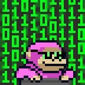

# MKTK117_Status:OPERATIONAL

# Hi there! 👋

My name is Mark, and I'm a passionate developer who loves to learn and solve tasks.

## Tech Stack 🛠️

## About Me 💼

I'm always on the lookout for new challenges. Whether it's building web or mobile applications, I'm dedicated to creating elegant solutions.

## Fun Facts 🚀

- I'm a Halo fan! 🎮🔫
- Coding, aviation, and gaming are my passions.
- I have a perfect sense of humor and am always up for a good laugh.
- Kind and open-minded, always ready to hear new ideas.

## Get in Touch 📫

Feel free to connect with me on www.linkedin.com/in/mktk117 . Let's collaborate and build something amazing together!

Happy coding! 👩‍💻🚀

